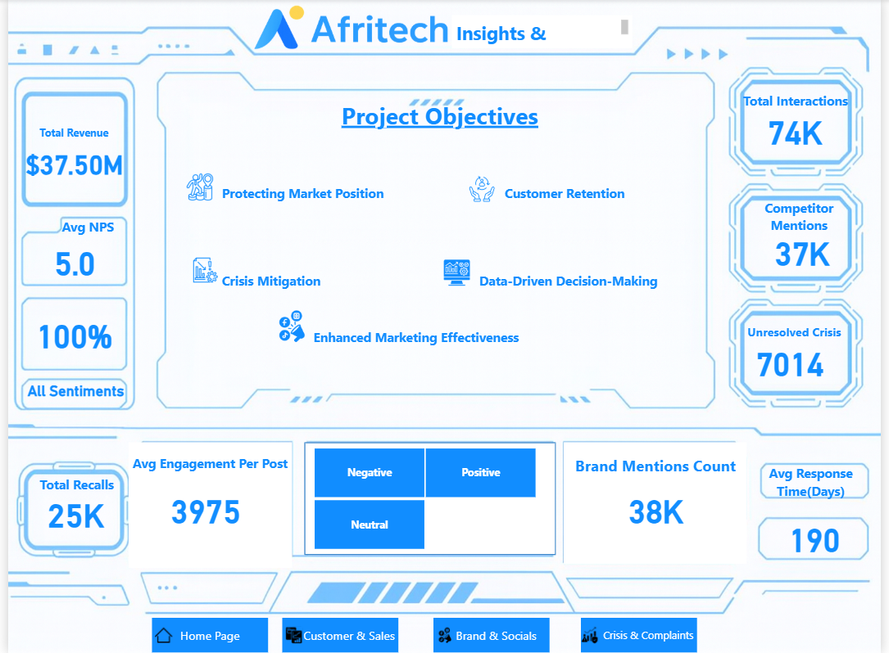
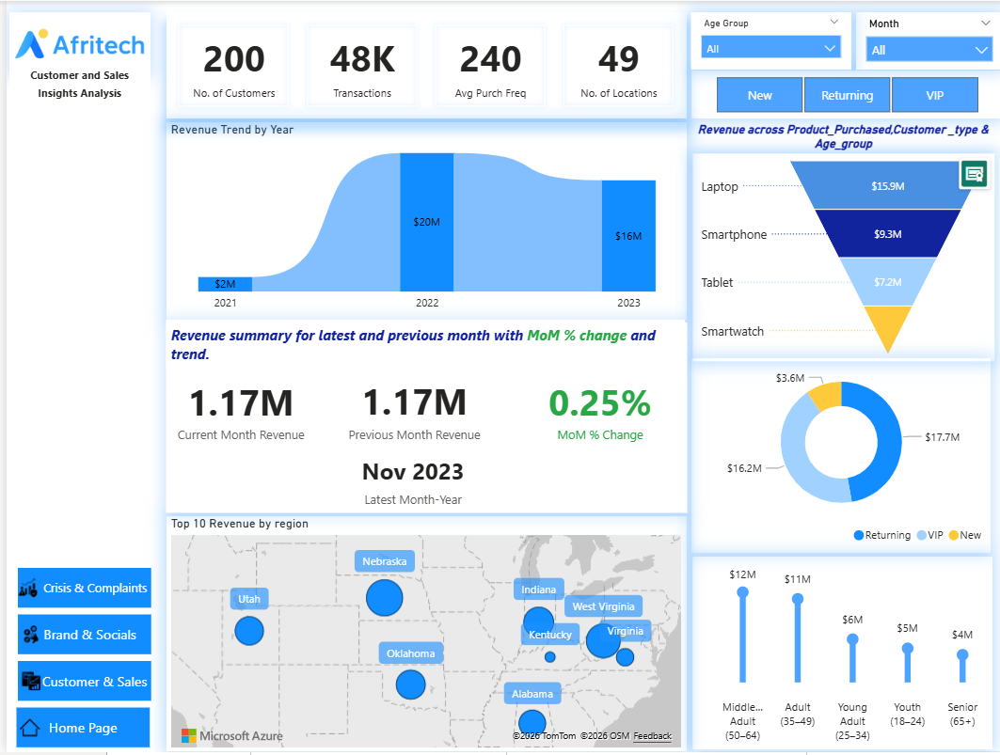
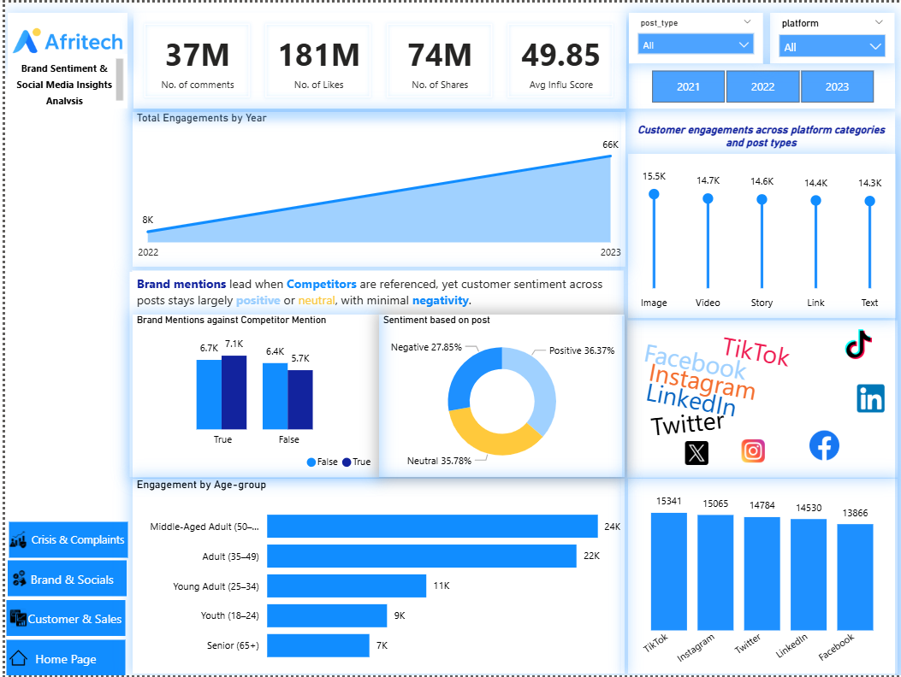

# afritech-social-media-monitoring-dashboard
Power BI dashboard analysing brand sentiment, product recalls, and crisis monitoring insights.

## Business Problem

AfriTech Electronics experienced declining customer trust due to rising product recalls, unresolved customer complaints, and increasing negative sentiment across social media platforms.

These issues created reputational risk, declining customer satisfaction, and competitive pressure from rival brands.

---

## Project Goal

Develop an intelligent monitoring dashboard to track brand mentions, customer sentiment, product recall patterns, and unresolved crisis indicators to support proactive reputation management.

---

## Key Business Questions

- Which regions have the highest product recall incidents?
- What percentage of customers express negative sentiment?
- Which customer groups drive the most revenue?
- How many crisis cases remain unresolved?
- How is brand engagement trending across social platforms?

---

## Tools & Technologies

- **Power BI** – dashboard development and interactive reporting  
- **SQL** – data extraction and analytical queries  
- **Data Modelling** – building relationships between datasets  
- **DAX** – creating calculated measures and KPIs  
- **Excel / CSV Dataset** – source data preparation

---
  
## Dashboard Preview

### Executive Overview

### Crisis & Complaints Monitoring

### Customer & Sales Insights

### Brand Sentiment & Social Media Insights

## Key Insights

- Over **74K social interactions** and **38K brand mentions** were analysed across multiple platforms.
- More than **7,000 unresolved crisis cases** were identified requiring operational intervention.
- **25,000 product recalls** significantly impacted customer trust and brand perception.
- Negative sentiment trends highlighted key reputation risks across multiple regions.
- Customer engagement analysis revealed that **middle-aged customers generate the highest engagement and revenue contribution**.

## Business Impact

The dashboard enables organisations to:

- Detect reputation risks early using sentiment analysis.
- Prioritise customer complaints and crisis cases faster.
- Monitor product recall patterns affecting customer trust.
- Track brand engagement across social platforms.
- Support data-driven decision making for marketing and crisis management teams.

## 📂 Project Files

Download the project resources below:

- 📊 Power BI Dashboard  
  👉  [Download Power BI Dashboard](afritech_dashboard.pbix)

- 🗄 SQL Data Analysis Queries  
  👉 [Download SQL Script](Afritech_Analysis.sql)

- 📑 Project Overview Presentation  
 👉 [Open Project Overview](afritech_project_overview.pptx)  
*(Click Download on the file page to download the presentation)*

- 📁 Dataset (CSV)  
  👉 [Download Dataset](https://raw.githubusercontent.com/Olu-DAnalyst/afritech-social-media-monitoring-dashboard/main/AfriTech_Data.csv)
