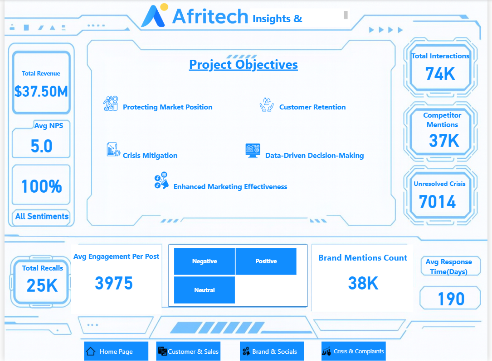
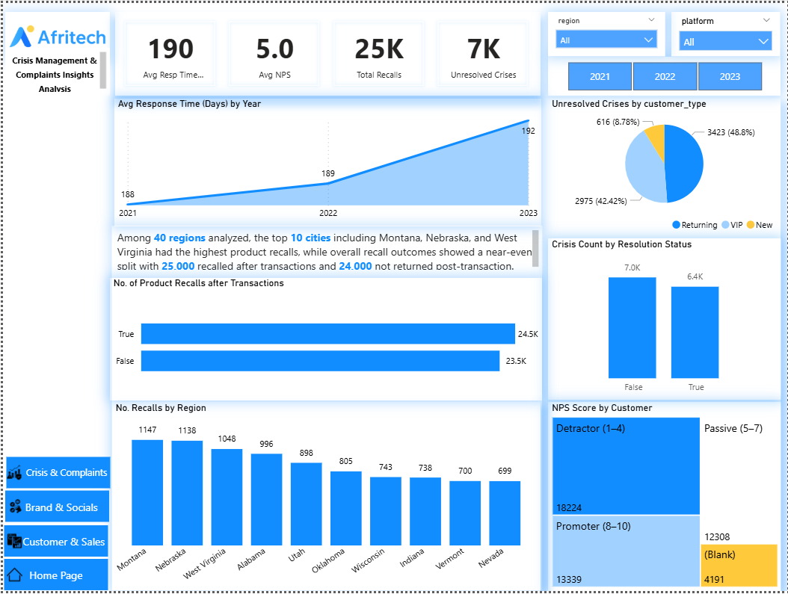
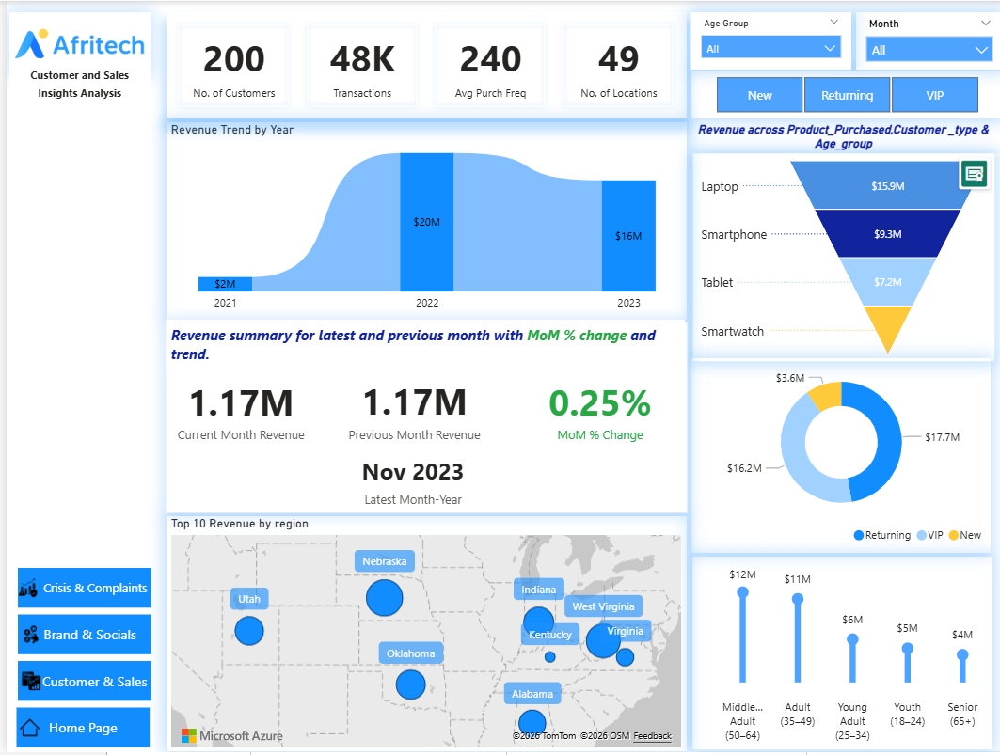
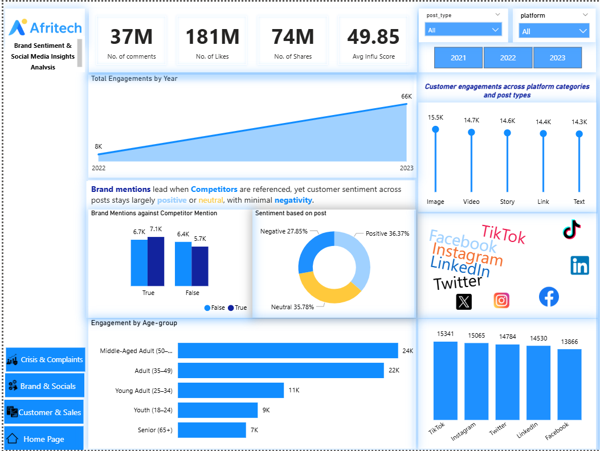

# Afritech-social-media-monitoring-dashboard
Power BI dashboard analysing brand sentiment, product recalls, and crisis monitoring insights.

## Business Problem

AfriTech Electronics experienced declining customer trust due to rising product recalls, unresolved customer complaints, and increasing negative sentiment across social media platforms.

These issues created reputational risk, declining customer satisfaction, and competitive pressure from rival brands.

---

## Project Goal

To design a monitoring solution that enables stakeholders to track sentiment, identify emerging risks, and take proactive action to protect brand reputation and improve customer experience.

---

## Key Business Questions

- Which regions have the highest product recall incidents?
- What percentage of customers express negative sentiment?
- Which customer groups drive the most revenue?
- How many crisis cases remain unresolved?
- How is brand engagement trending across social platforms?

---

## Tools & Technologies

- **Power BI** – dashboard development and interactive reporting  
- **SQL** – data extraction and analytical queries  
- **Data Modelling** – building relationships between datasets  
- **DAX** – creating calculated measures and KPIs  
- **Excel / CSV Dataset** – source data preparation

---
## 📸 Dashboard Preview

### Executive Overview (KPI Monitoring)
Displays total interactions, sentiment distribution, and crisis indicators used to monitor overall brand performance and risk levels.

---

### Crisis & Complaints Monitoring
Tracks unresolved cases, recall trends, and regional issues to identify operational bottlenecks and high-risk areas requiring attention.

---

### Customer & Sales Insights
Analyses revenue trends, customer segments, and purchasing behaviour to support data-driven marketing and sales decisions.

---

### Brand Sentiment & Social Media Insights
Visualises engagement trends and sentiment across platforms to detect reputation risks and customer perception patterns.

## Key Insights 

### 1. Large-scale interaction data highlights significant brand exposure  
Over **74K social interactions** and **38K brand mentions** were analysed, indicating high customer engagement and visibility across platforms. 

**Implication:**  
High exposure increases both growth opportunity and reputational risk, requiring continuous monitoring and rapid response to negative trends.

### 2. High volume of unresolved crisis cases signals operational inefficiencies  
More than **7,000 unresolved crisis cases** were identified, suggesting delays in response and escalation processes.  

**Implication:**  
Unresolved issues can escalate into wider reputational damage and reduce customer trust if not addressed promptly.  

### 3. Product recalls are a key driver of negative customer perception  
Approximately **25,000 product recalls** were recorded, significantly affecting customer confidence in product reliability.  

**Implication:**  
Frequent recalls indicate potential issues in product quality or supply chain processes, requiring investigation and corrective action.  

### 4. Critical Insight: Reputation risk is driven more by engagement than volume  
High-engagement posts showed stronger negative sentiment impact than overall volume, meaning viral complaints pose a disproportionately higher risk to brand perception.  

**Implication:**  
Managing visibility and response speed is more critical than simply reducing complaint volume.

### 5. High-engagement negative content amplifies reputational risk  
Negative sentiment was more prominent in high-engagement posts, meaning widely shared complaints have a disproportionate impact on brand perception.  

**Implication:**  
Viral complaints should be prioritised for rapid response to minimise reputational damage and customer churn risk.  

### 6. Customer engagement is concentrated within high-value demographic segments  
Middle-aged customers contributed the highest levels of engagement and revenue across analysed data.  

**Implication:**  
This segment represents a key revenue driver and should be prioritised in targeted marketing and retention strategies.  

## Recommended Actions

- Prioritise high-engagement complaints using a risk-based response model  
- Investigate root causes of product recalls in high-risk regions  
- Implement response time SLAs (e.g. <24 hours) to reduce unresolved cases  
- Focus retention and engagement strategies on high-value customer segments 
  
## Business Impact

This solution enables organisations to:

- Reduce reputational risk by identifying and responding to high-impact complaints earlier  
- Improve operational efficiency by highlighting unresolved crisis bottlenecks  
- Enhance customer satisfaction through faster issue resolution  
- Support data-driven decision-making across marketing, customer service, and operations  

**Potential Outcome:**  
Applying these insights could reduce negative sentiment exposure and improve response efficiency, leading to stronger customer trust and retention.

## 📂 Project Files

Download the project resources below:

- 📊 Power BI Dashboard  
  👉  [Download Power BI Dashboard](https://github.com/Olu-DAnalyst/afritech-social-media-monitoring-dashboard/blob/main/Afritech_dashboard.pbix)

- 🗄 SQL Data Analysis Queries  
  👉 [Download SQL Script](Afritech_Analysis.sql)

- 📑 Project Overview Presentation  
 👉 [Download Project Overview](https://github.com/Olu-DAnalyst/afritech-social-media-monitoring-dashboard/blob/main/afritech_%20project_overview.pptx)

- 📁 Dataset (CSV)  
  👉 [Download Dataset](https://raw.githubusercontent.com/Olu-DAnalyst/afritech-social-media-monitoring-dashboard/main/AfriTech_Data.csv)
